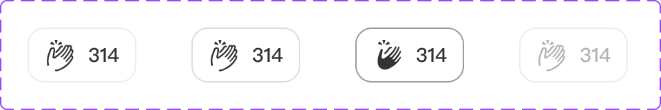

# Component: Action

## Overview

_（Figma 描述為空，請日後補完）_

## Source

- **Figma file**: Design System 1.5 (`JDKpHezhllOvJF42xbKcNN`)
- **Page**: Buttons
- **Type**: COMPONENT_SET
- **Node id**: `2931:751`
- **Key**: `f520251e8602c88cddef31400384d64b69585e65`
- **Open in Figma**: https://www.figma.com/design/JDKpHezhllOvJF42xbKcNN/Design-System-1.5?node-id=2931-751

## Variants

| Property | Default | Options |
| --- | --- | --- |
| State | `Default` | `Default`, `Hovering`, `Pressed`, `Disable` |

### Variant nodes

- `State=Default` — node `2908:528`
- `State=Disable` — node `2931:763`
- `State=Hovering` — node `2908:532`
- `State=Pressed` — node `2908:536`

## Design Tokens Used

### Linked Figma styles

| Figma style | Token (tokens.json) | Used for |
| --- | --- | --- |
| Grey Scale/Grey Hover (`FILL`) | _待對照_ | _待補_ |
| Grey Scale/Black (`FILL`) | _待對照_ | _待補_ |
| System/Body 2/Medium (`TEXT`) | _待對照_ | _待補_ |
| Grey Scale/Grey (`FILL`) | _待對照_ | _待補_ |
| Grey Scale/Grey Light (`FILL`) | _待對照_ | _待補_ |
| Grey Scale/Grey Dark (`FILL`) | _待對照_ | _待補_ |

### Fonts seen in tree

- PingFang TC / 500 / 14px

## States and Interactions

_實作時補入：hover / active / focus / disabled / loading / error_

## Responsive Behavior

_breakpoints 與 layout 變化（mobile / tablet / desktop）_

## Edge Cases

_長字串、空資料、權限不足等_

## Accessibility Notes

_對比度、鍵盤序、ARIA、screen reader_

## Dual-track Judgment

- 結構軌（atomic component）

## Preview

