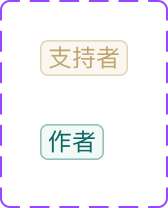

# Component: Label

## Overview

_（Figma 描述為空，請日後補完）_

## Source

- **Figma file**: Design System 1.5 (`JDKpHezhllOvJF42xbKcNN`)
- **Page**: Buttons
- **Type**: COMPONENT_SET
- **Node id**: `2938:844`
- **Key**: `63f21845fade63c360e24b717edfdc436755bb2a`
- **Open in Figma**: https://www.figma.com/design/JDKpHezhllOvJF42xbKcNN/Design-System-1.5?node-id=2938-844

## Variants

| Property | Default | Options |
| --- | --- | --- |
| Type | `Contributor` | `Contributor`, `Author` |

### Variant nodes

- `Type=Contributor` — node `2938:843`
- `Type=Author` — node `2938:845`

## Design Tokens Used

### Linked Figma styles

| Figma style | Token (tokens.json) | Used for |
| --- | --- | --- |
| Logo/Yellow Lighter (`FILL`) | _待對照_ | _待補_ |
| Logo/Matters Gold (`FILL`) | _待對照_ | _待補_ |
| System/Small/Regular (`TEXT`) | _待對照_ | _待補_ |
| Logo/Green Lighter (`FILL`) | _待對照_ | _待補_ |
| Logo/Matters Green (`FILL`) | _待對照_ | _待補_ |

### Fonts seen in tree

- PingFang TC / 400 / 12px

## States and Interactions

_實作時補入：hover / active / focus / disabled / loading / error_

## Responsive Behavior

_breakpoints 與 layout 變化（mobile / tablet / desktop）_

## Edge Cases

_長字串、空資料、權限不足等_

## Accessibility Notes

_對比度、鍵盤序、ARIA、screen reader_

## Dual-track Judgment

- 結構軌（atomic component）

## Preview

