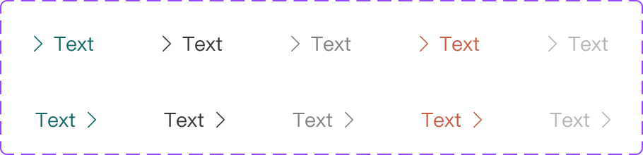

# Component: Link

## Overview

_（Figma 描述為空，請日後補完）_

## Source

- **Figma file**: Design System 1.5 (`JDKpHezhllOvJF42xbKcNN`)
- **Page**: Buttons
- **Type**: COMPONENT_SET
- **Node id**: `3306:17928`
- **Key**: `69a9c9ccf4227351c628534c40f6fbf2eeb0772c`
- **Open in Figma**: https://www.figma.com/design/JDKpHezhllOvJF42xbKcNN/Design-System-1.5?node-id=3306-17928

## Variants

| Property  | Default         | Options                                                     |
| --------- | --------------- | ----------------------------------------------------------- |
| Show Text | `true`          |                                                             |
| Show Icon | `true`          |                                                             |
| Text      | `Text`          |                                                             |
| Type      | `Matters Green` | `Matters Green`, `Black`, `Grey Darker`, `Error`, `Disable` |
| Icon      | `Left`          | `Left`, `Right`                                             |

### Variant nodes

- `Type=Matters Green, Icon=Left` — node `3299:16706`
- `Type=Black, Icon=Left` — node `3306:17912`
- `Type=Grey Darker, Icon=Left` — node `3306:17917`
- `Type=Error, Icon=Left` — node `3306:17922`
- `Type=Disable, Icon=Left` — node `3306:17927`
- `Type=Matters Green, Icon=Right` — node `4636:496`
- `Type=Black, Icon=Right` — node `4636:499`
- `Type=Grey Darker, Icon=Right` — node `4636:502`
- `Type=Error, Icon=Right` — node `4636:505`
- `Type=Disable, Icon=Right` — node `4636:508`

## Design Tokens Used

### Linked Figma styles

| Figma style                     | Token (tokens.json) | Used for |
| ------------------------------- | ------------------- | -------- |
| Logo/Matters Green (`FILL`)     | _待對照_            | _待補_   |
| System/Body 2/Regular (`TEXT`)  | _待對照_            | _待補_   |
| Grey Scale/Black (`FILL`)       | _待對照_            | _待補_   |
| Grey Scale/Grey Darker (`FILL`) | _待對照_            | _待補_   |
| Function/Negative red (`FILL`)  | _待對照_            | _待補_   |
| Grey Scale/Grey (`FILL`)        | _待對照_            | _待補_   |

### Fonts seen in tree

- PingFang TC / 400 / 14px

## States and Interactions

_實作時補入：hover / active / focus / disabled / loading / error_

## Responsive Behavior

_breakpoints 與 layout 變化（mobile / tablet / desktop）_

## Edge Cases

_長字串、空資料、權限不足等_

## Accessibility Notes

_對比度、鍵盤序、ARIA、screen reader_

## Dual-track Judgment

- 結構軌（atomic component）

## Preview

