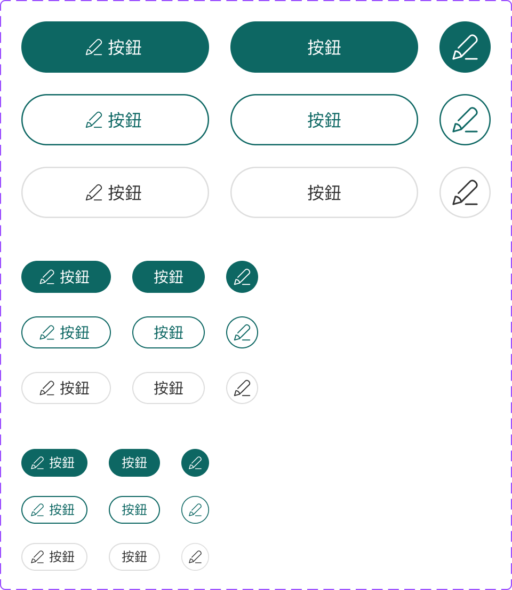

# Component: Normal

## Overview

_（Figma 描述為空，請日後補完）_

## Source

- **Figma file**: Design System 1.5 (`JDKpHezhllOvJF42xbKcNN`)
- **Page**: Buttons
- **Type**: COMPONENT_SET
- **Node id**: `3371:23079`
- **Key**: `b9b13ccd2b998b9493a804cc44a6fae56945cf94`
- **Open in Figma**: https://www.figma.com/design/JDKpHezhllOvJF42xbKcNN/Design-System-1.5?node-id=3371-23079

## Variants

| Property  | Default    | Options                            |
| --------- | ---------- | ---------------------------------- |
| Text      | `按鈕`     |                                    |
| Icon      | `4581:641` |                                    |
| Type      | `Primary`  | `Primary`, `Secondary`, `Tertiary` |
| Size      | `Large`    | `Large`, `Medium`, `Small`         |
| Show Icon | `on`       | `on`, `off`                        |
| Show Text | `on`       | `on`, `off`                        |

### Variant nodes

- `Type=Primary, Size=Large, Show Icon=on, Show Text=on` — node `3371:23080`
- `Type=Primary, Size=Large, Show Icon=off, Show Text=on` — node `3371:23737`
- `Type=Primary, Size=Large, Show Icon=on, Show Text=off` — node `3371:23083`
- `Type=Primary, Size=Medium, Show Icon=on, Show Text=on` — node `3371:23085`
- `Type=Primary, Size=Medium, Show Icon=off, Show Text=on` — node `3371:23791`
- `Type=Primary, Size=Small, Show Icon=on, Show Text=on` — node `3371:23088`
- `Type=Primary, Size=Medium, Show Icon=on, Show Text=off` — node `3371:23091`
- `Type=Primary, Size=Small, Show Icon=on, Show Text=off` — node `3371:23093`
- `Type=Secondary, Size=Large, Show Icon=on, Show Text=on` — node `3371:23140`
- `Type=Secondary, Size=Large, Show Icon=off, Show Text=on` — node `3371:23740`
- `Type=Secondary, Size=Large, Show Icon=on, Show Text=off` — node `3371:23143`
- `Type=Secondary, Size=Medium, Show Icon=on, Show Text=on` — node `3371:23145`
- `Type=Secondary, Size=Medium, Show Icon=off, Show Text=on` — node `3371:23794`
- `Type=Secondary, Size=Small, Show Icon=on, Show Text=on` — node `3371:23148`
- `Type=Secondary, Size=Medium, Show Icon=on, Show Text=off` — node `3371:23151`
- `Type=Secondary, Size=Small, Show Icon=on, Show Text=off` — node `3371:23153`
- `Type=Tertiary, Size=Large, Show Icon=on, Show Text=on` — node `3371:23200`
- `Type=Tertiary, Size=Large, Show Icon=off, Show Text=on` — node `3371:23743`
- `Type=Tertiary, Size=Large, Show Icon=on, Show Text=off` — node `3371:23203`
- `Type=Tertiary, Size=Medium, Show Icon=on, Show Text=on` — node `3371:23205`
- `Type=Tertiary, Size=Medium, Show Icon=off, Show Text=on` — node `3371:23797`
- `Type=Tertiary, Size=Small, Show Icon=on, Show Text=on` — node `3371:23208`
- `Type=Primary, Size=Small, Show Icon=off, Show Text=on` — node `3371:23818`
- `Type=Secondary, Size=Small, Show Icon=off, Show Text=on` — node `3371:23821`
- `Type=Tertiary, Size=Small, Show Icon=off, Show Text=on` — node `3371:23824`
- `Type=Tertiary, Size=Medium, Show Icon=on, Show Text=off` — node `3371:23211`
- `Type=Tertiary, Size=Small, Show Icon=on, Show Text=off` — node `3371:23213`

## Design Tokens Used

### Linked Figma styles

| Figma style                    | Token (tokens.json) | Used for |
| ------------------------------ | ------------------- | -------- |
| Logo/Matters Green (`FILL`)    | _待對照_            | _待補_   |
| Grey Scale/White (`FILL`)      | _待對照_            | _待補_   |
| System/Body 1/Regular (`TEXT`) | _待對照_            | _待補_   |
| System/Body 2/Regular (`TEXT`) | _待對照_            | _待補_   |
| System/Small/Regular (`TEXT`)  | _待對照_            | _待補_   |
| Grey Scale/Grey Light (`FILL`) | _待對照_            | _待補_   |
| Grey Scale/Black (`FILL`)      | _待對照_            | _待補_   |

### Fonts seen in tree

- PingFang TC / 400 / 16px
- PingFang TC / 400 / 14px
- PingFang TC / 400 / 12px

## States and Interactions

| State         | Primary                                                                              | Secondary                                    | Tertiary                              |
| ------------- | ------------------------------------------------------------------------------------ | -------------------------------------------- | ------------------------------------- |
| default       | bg=`brand.new.purple`, fg=`grey.white`                                               | border+fg=`brand.new.purple`, bg=transparent | fg=`brand.new.purple`, bg=transparent |
| hover         | bg=`primary.700`                                                                     | bg=`primary.0`                               | bg=`primary.0`                        |
| active        | bg=`primary.800`                                                                     | bg=`primary.100`                             | bg=`primary.100`                      |
| focus-visible | outline 2px solid `brand.new.purple`, offset 2px                                     | 同左                                         | 同左                                  |
| disabled      | `opacity: 0.4`, `cursor: not-allowed`（套在 `:disabled` / `[aria-disabled="true"]`） | 同左                                         | 同左                                  |

過渡：`background-color`/`border-color`/`color` 共用 120ms ease。

## Responsive Behavior

無自身 breakpoint。Size 由父層 layout 選擇（Large=表單主 CTA / Medium=卡片內 CTA / Small=次要操作）。CTA 在 mobile 通常 full-width — 由父層套 `width: 100%`，而非 component 內建。

## Edge Cases

- **長字串**：`white-space: nowrap`，由父層處理 truncation 或 wrap，不要讓 button 自己變多行
- **icon-only**：必須給 `aria-label`，否則 screen reader 沒內容可讀
- **i18n**：CJK 字寬比拉丁字寬，padding 已預留；超長翻譯（如德文）父層需控長度
- **載入中**：當前 impl 不含 spinner；若需要，建議 `aria-busy="true"` + 替換 icon slot（保留外形避免抖動）

## Accessibility Notes

- 對比度：Primary（白字 / 紫底）AA pass、Secondary/Tertiary（紫字 / 白底）AA pass
- 鍵盤：原生 `<button>` 有 Tab focus 與 Enter/Space 觸發；`focus-visible` 用 outline 2px 紫
- ARIA：disabled 狀態優先用原生 `disabled`；若需要保留 focus（讓 sr 讀到禁用原因）改用 `aria-disabled="true"`
- icon-only：必填 `aria-label`
- 觸控目標：Small 高度 28px 接近 WCAG 24px 下限；mobile 用 Medium 或 Large 較安全

## Dual-track Judgment

- 結構軌（atomic component）

## Preview

