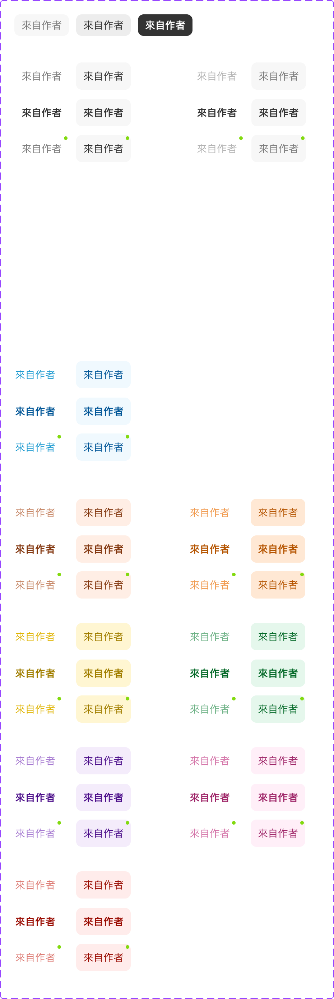

# Component: Tab item

## Overview

_（Figma 描述為空，請日後補完）_

## Source

- **Figma file**: Design System 1.5 (`JDKpHezhllOvJF42xbKcNN`)
- **Page**: Buttons
- **Type**: COMPONENT_SET
- **Node id**: `2989:753`
- **Key**: `6ae02c25c274b2c9b52576a32e64bbc27f2182d8`
- **Open in Figma**: https://www.figma.com/design/JDKpHezhllOvJF42xbKcNN/Design-System-1.5?node-id=2989-753

## Variants

| Property | Default    | Options                                                                                   |
| -------- | ---------- | ----------------------------------------------------------------------------------------- |
| Text     | `來自作者` |                                                                                           |
| State    | `Default`  | `Selected`, `Default`, `New Event`                                                        |
| Type     | `Normal`   | `Normal`, `Sidebar`                                                                       |
| Color    | `No`       | `Free Write`, `No`, `Brown`, `Orange`, `Yellow`, `Green`, `Purple`, `Pink`, `Red`, `Grey` |
| Hover    | `Off`      | `Off`, `On`                                                                               |

### Variant nodes

- `State=Selected, Type=Normal, Color=No, Hover=Off` — node `2989:754`
- `State=Default, Type=Normal, Color=No, Hover=On` — node `2989:756`
- `State=Default, Type=Normal, Color=No, Hover=Off` — node `2989:758`
- `State=Default, Type=Sidebar, Color=No, Hover=Off` — node `4688:770`
- `State=Default, Type=Sidebar, Color=Grey, Hover=Off` — node `5364:1070`
- `State=New Event, Type=Sidebar, Color=No, Hover=Off` — node `5074:1446`
- `State=New Event, Type=Sidebar, Color=Grey, Hover=Off` — node `5364:1073`
- `State=New Event, Type=Sidebar, Color=No, Hover=On` — node `5239:782`
- `State=New Event, Type=Sidebar, Color=Grey, Hover=On` — node `5364:1077`
- `State=Default, Type=Sidebar, Color=Free Write, Hover=Off` — node `5041:773`
- `State=Default, Type=Sidebar, Color=Brown, Hover=Off` — node `5341:1351`
- `State=Default, Type=Sidebar, Color=Yellow, Hover=Off` — node `5341:1579`
- `State=Default, Type=Sidebar, Color=Purple, Hover=Off` — node `5341:1671`
- `State=Default, Type=Sidebar, Color=Red, Hover=Off` — node `5341:1763`
- `State=Default, Type=Sidebar, Color=Orange, Hover=Off` — node `5341:1533`
- `State=Default, Type=Sidebar, Color=Green, Hover=Off` — node `5341:1625`
- `State=Default, Type=Sidebar, Color=Pink, Hover=Off` — node `5341:1717`
- `State=New Event, Type=Sidebar, Color=Free Write, Hover=Off` — node `5074:1461`
- `State=New Event, Type=Sidebar, Color=Brown, Hover=Off` — node `5341:1354`
- `State=New Event, Type=Sidebar, Color=Yellow, Hover=Off` — node `5341:1582`
- `State=New Event, Type=Sidebar, Color=Purple, Hover=Off` — node `5341:1674`
- `State=New Event, Type=Sidebar, Color=Red, Hover=Off` — node `5341:1766`
- `State=New Event, Type=Sidebar, Color=Orange, Hover=Off` — node `5341:1536`
- `State=New Event, Type=Sidebar, Color=Green, Hover=Off` — node `5341:1628`
- `State=New Event, Type=Sidebar, Color=Pink, Hover=Off` — node `5341:1720`
- `State=New Event, Type=Sidebar, Color=Free Write, Hover=On` — node `5239:798`
- `State=New Event, Type=Sidebar, Color=Brown, Hover=On` — node `5341:1358`
- `State=New Event, Type=Sidebar, Color=Yellow, Hover=On` — node `5341:1586`
- `State=New Event, Type=Sidebar, Color=Purple, Hover=On` — node `5341:1678`
- `State=New Event, Type=Sidebar, Color=Red, Hover=On` — node `5341:1770`
- `State=New Event, Type=Sidebar, Color=Orange, Hover=On` — node `5341:1540`
- `State=New Event, Type=Sidebar, Color=Green, Hover=On` — node `5341:1632`
- `State=New Event, Type=Sidebar, Color=Pink, Hover=On` — node `5341:1724`
- `State=Default, Type=Sidebar, Color=No, Hover=On` — node `4688:772`
- `State=Default, Type=Sidebar, Color=Grey, Hover=On` — node `5364:1081`
- `State=Default, Type=Sidebar, Color=Free Write, Hover=On` — node `5041:776`
- `State=Default, Type=Sidebar, Color=Brown, Hover=On` — node `5341:1362`
- `State=Default, Type=Sidebar, Color=Yellow, Hover=On` — node `5341:1590`
- `State=Default, Type=Sidebar, Color=Purple, Hover=On` — node `5341:1682`
- `State=Default, Type=Sidebar, Color=Red, Hover=On` — node `5341:1774`
- `State=Default, Type=Sidebar, Color=Orange, Hover=On` — node `5341:1544`
- `State=Default, Type=Sidebar, Color=Green, Hover=On` — node `5341:1636`
- `State=Default, Type=Sidebar, Color=Pink, Hover=On` — node `5341:1728`
- `State=Selected, Type=Sidebar, Color=No, Hover=Off` — node `4688:774`
- `State=Selected, Type=Sidebar, Color=Grey, Hover=Off` — node `5364:1084`
- `State=Selected, Type=Sidebar, Color=No, Hover=On` — node `5239:786`
- `State=Selected, Type=Sidebar, Color=Grey, Hover=On` — node `5364:1087`
- `State=Selected, Type=Sidebar, Color=Free Write, Hover=Off` — node `5041:779`
- `State=Selected, Type=Sidebar, Color=Brown, Hover=Off` — node `5341:1365`
- `State=Selected, Type=Sidebar, Color=Yellow, Hover=Off` — node `5341:1593`
- `State=Selected, Type=Sidebar, Color=Purple, Hover=Off` — node `5341:1685`
- `State=Selected, Type=Sidebar, Color=Red, Hover=Off` — node `5341:1777`
- `State=Selected, Type=Sidebar, Color=Orange, Hover=Off` — node `5341:1547`
- `State=Selected, Type=Sidebar, Color=Green, Hover=Off` — node `5341:1639`
- `State=Selected, Type=Sidebar, Color=Pink, Hover=Off` — node `5341:1731`
- `State=Selected, Type=Sidebar, Color=Free Write, Hover=On` — node `5239:802`
- `State=Selected, Type=Sidebar, Color=Brown, Hover=On` — node `5341:1368`
- `State=Selected, Type=Sidebar, Color=Yellow, Hover=On` — node `5341:1596`
- `State=Selected, Type=Sidebar, Color=Purple, Hover=On` — node `5341:1688`
- `State=Selected, Type=Sidebar, Color=Red, Hover=On` — node `5341:1780`
- `State=Selected, Type=Sidebar, Color=Orange, Hover=On` — node `5341:1550`
- `State=Selected, Type=Sidebar, Color=Green, Hover=On` — node `5341:1642`
- `State=Selected, Type=Sidebar, Color=Pink, Hover=On` — node `5341:1734`

## Design Tokens Used

### Linked Figma styles

| Figma style                        | Token (tokens.json) | Used for |
| ---------------------------------- | ------------------- | -------- |
| Grey Scale/Black (`FILL`)          | _待對照_            | _待補_   |
| Grey Scale/White (`FILL`)          | _待對照_            | _待補_   |
| System/Body 2/Semibold (`TEXT`)    | _待對照_            | _待補_   |
| Grey Scale/Grey Hover (`FILL`)     | _待對照_            | _待補_   |
| System/Body 2/Regular (`TEXT`)     | _待對照_            | _待補_   |
| Grey Scale/Grey Lighter (`FILL`)   | _待對照_            | _待補_   |
| Grey Scale/Grey Darker (`FILL`)    | _待對照_            | _待補_   |
| Grey Scale/Grey (`FILL`)           | _待對照_            | _待補_   |
| New Palette/Secondary/500 (`FILL`) | _待對照_            | _待補_   |
| Freewrite/Text (`FILL`)            | _待對照_            | _待補_   |
| Freewrite/Background (`FILL`)      | _待對照_            | _待補_   |
| Freewrite/Text Dark (`FILL`)       | _待對照_            | _待補_   |

### Fonts seen in tree

- PingFang TC / 600 / 14px
- PingFang TC / 400 / 14px

## States and Interactions

_實作時補入：hover / active / focus / disabled / loading / error_

## Responsive Behavior

_breakpoints 與 layout 變化（mobile / tablet / desktop）_

## Edge Cases

_長字串、空資料、權限不足等_

## Accessibility Notes

_對比度、鍵盤序、ARIA、screen reader_

## Dual-track Judgment

- 結構軌（atomic component）

## Preview

