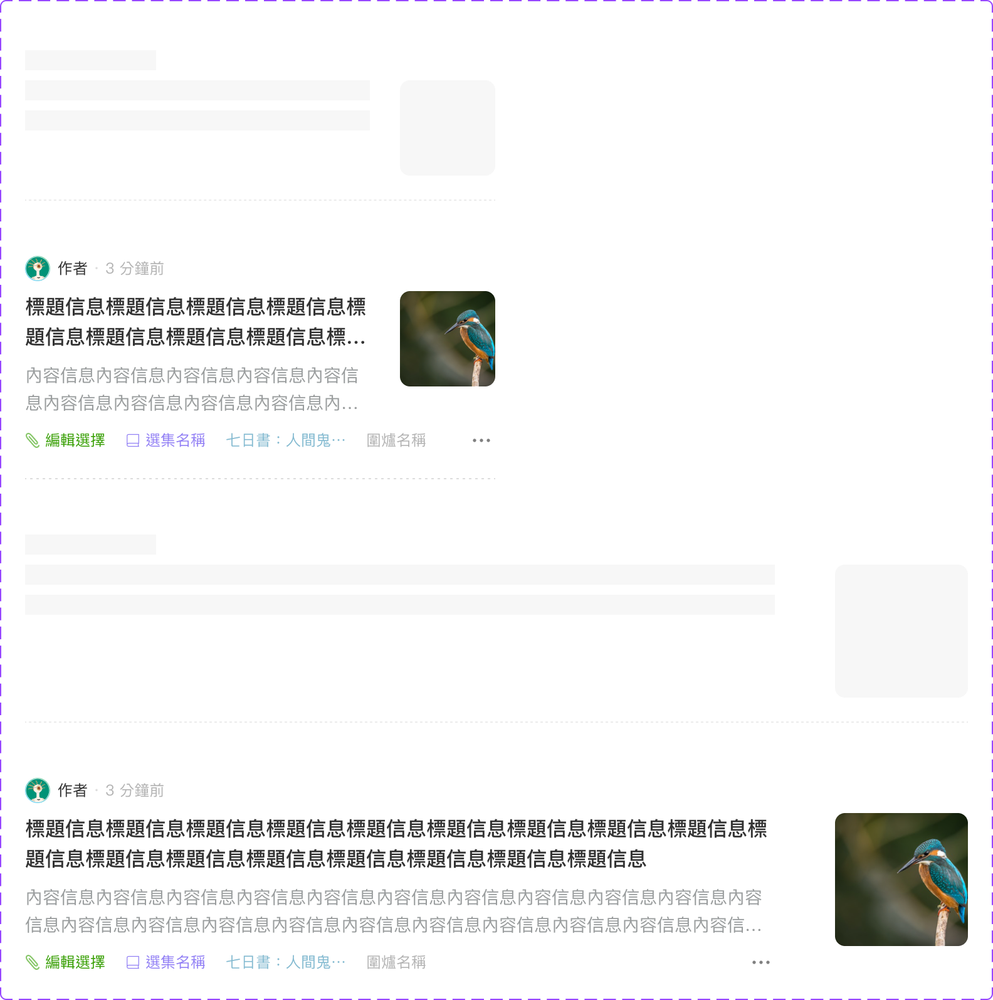

# Component: Article Card

## Overview

_（Figma 描述為空，請日後補完）_

## Source

- **Figma file**: Design System 1.5 (`JDKpHezhllOvJF42xbKcNN`)
- **Page**: Card
- **Type**: COMPONENT_SET
- **Node id**: `4853:994`
- **Key**: `64e7d8959ef4341f682e6fcc1b1ca40059f71d54`
- **Open in Figma**: https://www.figma.com/design/JDKpHezhllOvJF42xbKcNN/Design-System-1.5?node-id=4853-994

## Variants

| Property | Default | Options |
| --- | --- | --- |
| Type | `Follow` | `Follow` |
| State | `Placeholder` | `Default`, `Placeholder` |
| Device | `Mobile` | `Mobile`, `Desktop` |
| Photo Size | `Small` | `Big`, `Small` |

### Variant nodes

- `Type=Follow, State=Placeholder, Device=Mobile, Photo Size=Small` — node `4853:913`
- `Type=Follow, State=Default, Device=Mobile, Photo Size=Small` — node `4853:944`
- `Type=Follow, State=Placeholder, Device=Desktop, Photo Size=Big` — node `5073:1075`
- `Type=Follow, State=Default, Device=Desktop, Photo Size=Big` — node `5073:1026`

## Design Tokens Used

### Linked Figma styles

| Figma style | Token (tokens.json) | Used for |
| --- | --- | --- |
| <unknown 3274:6892> (``) | _待對照_ | _待補_ |
| Grey Scale/Grey Lighter (`FILL`) | _待對照_ | _待補_ |
| Grey Scale/Grey Light (`FILL`) | _待對照_ | _待補_ |
| <unknown 546:96> (``) | _待對照_ | _待補_ |
| System/Small/Regular (`TEXT`) | _待對照_ | _待補_ |
| Grey Scale/Grey (`FILL`) | _待對照_ | _待補_ |
| Grey Scale/Black (`FILL`) | _待對照_ | _待補_ |
| System/Body 1/Medium (`TEXT`) | _待對照_ | _待補_ |
| Grey Scale/Grey Dark (`FILL`) | _待對照_ | _待補_ |
| System/Body 2/Regular (`TEXT`) | _待對照_ | _待補_ |
| Grey Scale/Grey Darker (`FILL`) | _待對照_ | _待補_ |

### Fonts seen in tree

- PingFang TC / 400 / 12px
- PingFang TC / 500 / 16px
- PingFang TC / 400 / 14px

## States and Interactions

_實作時補入：hover / active / focus / disabled / loading / error_

## Responsive Behavior

_breakpoints 與 layout 變化（mobile / tablet / desktop）_

## Edge Cases

_長字串、空資料、權限不足等_

## Accessibility Notes

_對比度、鍵盤序、ARIA、screen reader_

## Dual-track Judgment

- 結構軌（含模板特徵，可能跨入模板軌；實作時再判定）

## Preview

