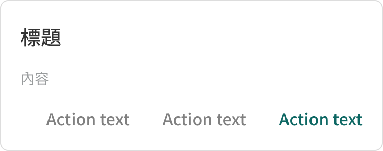

# Component: Dialog

## Overview

DS 1.5 modal dialog. White panel on a dimmed backdrop, with title, description/body, and a right-aligned action row. The Figma source describes only the panel — the React implementation supplies the surrounding accessibility infrastructure (portal, backdrop, focus trap, scroll lock, Escape close).

Used for confirmations, lightweight forms, and contextual choices. Not for full-screen workflows — use a dedicated route for those.

## Source

- **Figma file**: Design System 1.5 (`JDKpHezhllOvJF42xbKcNN`)
- **Page**: Feedback
- **Type**: COMPONENT
- **Node id**: `3404:1953`
- **Key**: `22823f1b406f0529bfbc8940798c7cb22f9ca144`
- **Open in Figma**: https://www.figma.com/design/JDKpHezhllOvJF42xbKcNN/Design-System-1.5?node-id=3404-1953

## Design Tokens Used

### Linked Figma styles → canonical tokens

| Figma style                     | Token / variable                                                | Used for                   |
| ------------------------------- | --------------------------------------------------------------- | -------------------------- |
| Grey Scale/White (`FILL`)       | `--color-grey-white`                                            | panel background           |
| Grey Scale/Grey Light (`FILL`)  | `--color-grey-grey-light`                                       | panel border `#DDD`        |
| Grey Scale/Black (`FILL`)       | `--color-grey-black`                                            | title text `#333`          |
| System/H2/Medium (`TEXT`)       | 20px / lh 30 / PingFang TC 500                                  | title                      |
| Grey Scale/Grey Dark (`FILL`)   | `--color-grey-grey-darker` (closest existing)                   | description text `#999C9D` |
| System/Body 2/Regular (`TEXT`)  | 14px / lh 22 / PingFang TC 400                                  | description, body          |
| Grey Scale/Grey Darker (`FILL`) | `--color-grey-grey-darker`                                      | secondary action label     |
| System/Body 1/Medium (`TEXT`)   | 16px / lh 24 / PingFang TC 500                                  | action labels              |
| Logo/Matters Green (`FILL`)     | **remap → `--color-brand-new-purple`** (PM 2026-04-24 decision) | primary action label       |

### Fonts seen in tree

- PingFang TC / 500 / 20px / lh 30 — title
- PingFang TC / 400 / 14px / lh 22 — description, body
- PingFang TC / 500 / 16px / lh 24 — actions

## States and Interactions

| State / event            | Behaviour                                                                                 |
| ------------------------ | ----------------------------------------------------------------------------------------- |
| Open                     | Backdrop fades in (120ms), panel pops from 96% to 100% (140ms) with cubic-bezier ease-out |
| Initial focus            | First focusable child inside the panel; falls back to the panel itself                    |
| Focus trap               | Tab + Shift+Tab cycle within the panel; no escape to background DOM                       |
| Escape key               | Calls `onClose()` (configurable via `closeOnEscape={false}`)                              |
| Backdrop click           | Calls `onClose()` (configurable via `closeOnBackdropClick={false}`)                       |
| Close (any path)         | Restores focus to the previously-focused element (or `returnFocusRef` if provided)        |
| Body scroll              | Locked while open (`document.body.style.overflow = "hidden"`) and restored on close       |
| `prefers-reduced-motion` | Animations disabled; dialog appears instantly                                             |

Action button states:

| State    | Primary action                                     | Secondary action                     |
| -------- | -------------------------------------------------- | ------------------------------------ |
| Idle     | Text `--color-brand-new-purple`                    | Text `--color-grey-grey-darker`      |
| Hover    | Background `--color-primary-0`                     | Background `--color-grey-grey-hover` |
| Focus    | 2px outline `--color-brand-new-purple`, 2px offset |
| Disabled | Opacity 0.4, cursor `not-allowed`                  | Same                                 |

## Responsive Behavior

| Breakpoint | Layout                                                                                         |
| ---------- | ---------------------------------------------------------------------------------------------- |
| ≥ 481px    | Centered panel, 16px gutter from viewport, max-width by `size` prop                            |
| ≤ 480px    | Bottom sheet: panel docked to bottom, full-width, top corners rounded 16px, slide-up animation |

Sizes:

- `small` (default) — `max-width: 375px`
- `medium` — `max-width: 480px`
- `large` — `max-width: 640px`

## Edge Cases

- **No title**: pass `aria-label` so the dialog still has an accessible name.
- **Tall content**: panel grows; if it exceeds viewport height the panel itself doesn't scroll yet (Phase 2 limitation). For long forms wrap the body region in your own scroll container or use a full route.
- **Three actions** (e.g. cancel / discard / save): the action row wraps if the row exceeds 100% width. The Figma source uses a fixed 32px gap between actions.
- **Multiple dialogs**: not stacked. Open one at a time; nested dialogs out of scope for Phase 2.
- **SSR**: portal rendering is gated by `typeof document !== "undefined"`. During SSR the dialog renders nothing; first client effect hydrates it.

## Accessibility Notes

- `role="dialog"` + `aria-modal="true"` set on the panel.
- `aria-labelledby` auto-wired to `Dialog.Title`'s id (no manual setup needed).
- `aria-describedby` auto-wired to `Dialog.Description`'s id when present.
- Focus is trapped while the dialog is open; focus returns to the trigger on close.
- Escape closes by default — keyboard-first usage works.
- Backdrop click closes by default — fits user mental model for "dismiss".
- For destructive confirmations (delete, leave), prefer `closeOnBackdropClick={false}` so a stray click doesn't accidentally cancel.
- WCAG 2.1: contrast for primary action `#7258FF` on white passes AA; secondary `#808080` on white is 4.5:1.

## Implementation

- **React**: [`packages/react/src/components/Dialog/`](../../../packages/react/src/components/Dialog/)
- Public API: `Dialog`, `Dialog.Title`, `Dialog.Description`, `Dialog.Body`, `Dialog.Actions`, `Dialog.ActionPrimary`, `Dialog.ActionSecondary` from `@matters/design-system-react`
- Self-contained (no Radix dep). Bundle delta ~3KB gzipped.
- Vendored copy: not yet shipped — vanilla HTML/CSS port lives behind Phase 4 unless someone needs it sooner.

## Dual-track Judgment

- 結構軌（compound component with focus management）
- Cannot be implemented as a pure copy-paste vanilla snippet without losing the focus trap. The npm package is the right primary channel; copy-and-own works for full-source consumers.

## Preview

