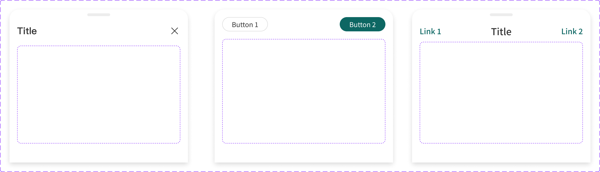

# Component: Drawer Panel - Mobile

## Overview

_（Figma 描述為空，請日後補完）_

## Source

- **Figma file**: Design System 1.5 (`JDKpHezhllOvJF42xbKcNN`)
- **Page**: Feedback
- **Type**: COMPONENT_SET
- **Node id**: `3373:24752`
- **Key**: `8e7401de5cf35fea63f9c8035cddace6059f41d6`
- **Open in Figma**: https://www.figma.com/design/JDKpHezhllOvJF42xbKcNN/Design-System-1.5?node-id=3373-24752

## Variants

| Property | Default | Options       |
| -------- | ------- | ------------- |
| Type     | `1`     | `1`, `2`, `3` |

### Variant nodes

- `Type=2` — node `3373:24750`
- `Type=3` — node `3373:24749`
- `Type=1` — node `3373:24751`

## Design Tokens Used

### Linked Figma styles

| Figma style                    | Token (tokens.json) | Used for |
| ------------------------------ | ------------------- | -------- |
| Grey Scale/White (`FILL`)      | _待對照_            | _待補_   |
| <unknown 2989:924> (``)        | _待對照_            | _待補_   |
| Grey Scale/Grey Light (`FILL`) | _待對照_            | _待補_   |
| Logo/Matters Green (`FILL`)    | _待對照_            | _待補_   |
| System/Body 1/Medium (`TEXT`)  | _待對照_            | _待補_   |
| Grey Scale/Black (`FILL`)      | _待對照_            | _待補_   |
| System/H2/Medium (`TEXT`)      | _待對照_            | _待補_   |
| System/H2/Semibold (`TEXT`)    | _待對照_            | _待補_   |

### Fonts seen in tree

- PingFang TC / 500 / 16px
- PingFang TC / 500 / 20px
- PingFang TC / 600 / 20px

## States and Interactions

_實作時補入：hover / active / focus / disabled / loading / error_

## Responsive Behavior

_breakpoints 與 layout 變化（mobile / tablet / desktop）_

## Edge Cases

_長字串、空資料、權限不足等_

## Accessibility Notes

_對比度、鍵盤序、ARIA、screen reader_

## Dual-track Judgment

- 結構軌（含模板特徵，可能跨入模板軌；實作時再判定）

## Preview

