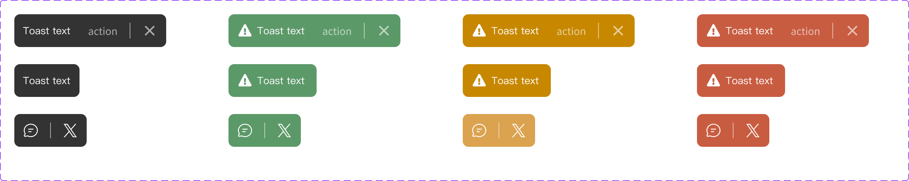

# Component: Toast

## Overview

_（Figma 描述為空，請日後補完）_

## Source

- **Figma file**: Design System 1.5 (`JDKpHezhllOvJF42xbKcNN`)
- **Page**: Feedback
- **Type**: COMPONENT_SET
- **Node id**: `2341:14260`
- **Key**: `7f0f4068712a36d4e12679dfdd2909c6cf87faec`
- **Open in Figma**: https://www.figma.com/design/JDKpHezhllOvJF42xbKcNN/Design-System-1.5?node-id=2341-14260

## Variants

_（無 variant property，但 children 包含 variant instances，可手動歸納）_

### Variant nodes

- `State=Normal, action=on, Type=Lettering` — node `2235:13565`
- `Type=Icon, State=Normal, action=on` — node `4525:1151`
- `State=Normal, action=on, Type=Icon` — node `4525:1207`
- `State=Normal, action=on, Type=Icon` — node `4525:1219`
- `State=Normal, action=on, Type=Icon` — node `4525:1231`
- `State=Normal, action=off, Type=Lettering` — node `2341:14259`
- `State=Negative, action=on, Type=Lettering` — node `2341:14257`
- `State=Warn, action=on, Type=Lettering` — node `3445:3474`
- `State=Positive, action=on, Type=Lettering` — node `3445:3494`
- `State=Negative, action=off, Type=Lettering` — node `2341:14258`
- `State=Warn, action=off, Type=Lettering` — node `3445:3482`
- `State=Positive, action=off, Type=Lettering` — node `3445:3502`

## Design Tokens Used

### Linked Figma styles

| Figma style | Token (tokens.json) | Used for |
| --- | --- | --- |
| Grey Scale/Black (`FILL`) | _待對照_ | _待補_ |
| Grey Scale/White (`FILL`) | _待對照_ | _待補_ |
| System/Body 2/Regular (`TEXT`) | _待對照_ | _待補_ |
| Grey Scale/White 60% (`FILL`) | _待對照_ | _待補_ |
| Function/Positive green (`FILL`) | _待對照_ | _待補_ |
| Function/Warn yellow (`FILL`) | _待對照_ | _待補_ |
| Function/Negative red (`FILL`) | _待對照_ | _待補_ |

### Fonts seen in tree

- PingFang TC / 400 / 14px

## States and Interactions

_實作時補入：hover / active / focus / disabled / loading / error_

## Responsive Behavior

_breakpoints 與 layout 變化（mobile / tablet / desktop）_

## Edge Cases

_長字串、空資料、權限不足等_

## Accessibility Notes

_對比度、鍵盤序、ARIA、screen reader_

## Dual-track Judgment

- 結構軌（atomic component）

## Preview

