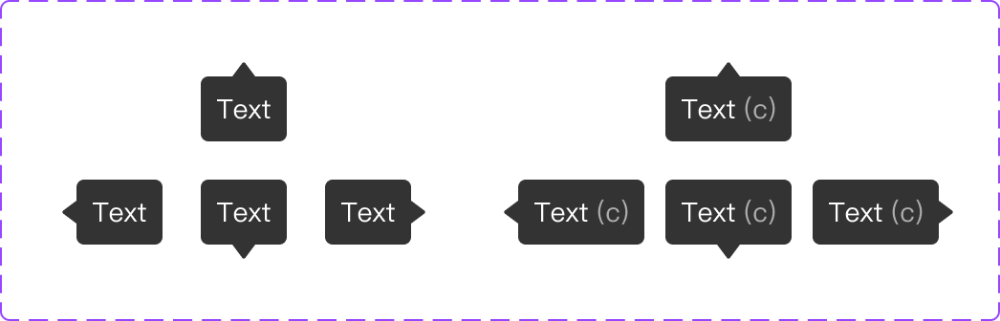

# Component: Tooltip

## Overview

_（Figma 描述為空，請日後補完）_

## Source

- **Figma file**: Design System 1.5 (`JDKpHezhllOvJF42xbKcNN`)
- **Page**: Feedback
- **Type**: COMPONENT_SET
- **Node id**: `2140:17420`
- **Key**: `460ed54c2940d926410a3e7912894f61b6123f11`
- **Open in Figma**: https://www.figma.com/design/JDKpHezhllOvJF42xbKcNN/Design-System-1.5?node-id=2140-17420

## Variants

| Property | Default | Options                       |
| -------- | ------- | ----------------------------- |
| Text     | `Text`  |                               |
| Type     | `Up`    | `Down`, `Up`, `Right`, `Left` |
| Hotkey   | `Off`   | `On`, `Off`                   |

### Variant nodes

- `Type=Down, Hotkey=Off` — node `2140:17421`
- `Type=Down, Hotkey=On` — node `5481:425`
- `Type=Right, Hotkey=Off` — node `2140:17425`
- `Type=Right, Hotkey=On` — node `5481:429`
- `Type=Left, Hotkey=Off` — node `2140:17429`
- `Type=Left, Hotkey=On` — node `5481:433`
- `Type=Up, Hotkey=Off` — node `2140:17433`
- `Type=Up, Hotkey=On` — node `5481:437`

## Design Tokens Used

### Linked Figma styles

| Figma style                    | Token (tokens.json) | Used for |
| ------------------------------ | ------------------- | -------- |
| Grey Scale/Black (`FILL`)      | _待對照_            | _待補_   |
| Grey Scale/White (`FILL`)      | _待對照_            | _待補_   |
| System/Body 2/Regular (`TEXT`) | _待對照_            | _待補_   |
| Grey Scale/White 60% (`FILL`)  | _待對照_            | _待補_   |

### Fonts seen in tree

- PingFang TC / 400 / 14px

## States and Interactions

_實作時補入：hover / active / focus / disabled / loading / error_

## Responsive Behavior

_breakpoints 與 layout 變化（mobile / tablet / desktop）_

## Edge Cases

_長字串、空資料、權限不足等_

## Accessibility Notes

_對比度、鍵盤序、ARIA、screen reader_

## Dual-track Judgment

- 結構軌（atomic component）

## Preview

