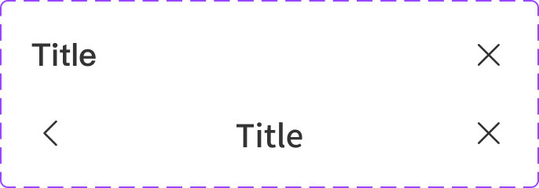

# Component: Top bar - Desktop

## Overview

_（Figma 描述為空，請日後補完）_

## Source

- **Figma file**: Design System 1.5 (`JDKpHezhllOvJF42xbKcNN`)
- **Page**: Feedback
- **Type**: COMPONENT_SET
- **Node id**: `2989:1528`
- **Key**: `a721373a769dec4814a88d6b29315528d413c603`
- **Open in Figma**: https://www.figma.com/design/JDKpHezhllOvJF42xbKcNN/Design-System-1.5?node-id=2989-1528

## Variants

| Property | Default | Options |
| --- | --- | --- |
| Text | `Title` |  |
| Type | `Left` | `Left`, `Center` |

### Variant nodes

- `Type=Center` — node `3352:20814`
- `Type=Left` — node `2989:1534`

## Design Tokens Used

### Linked Figma styles

| Figma style | Token (tokens.json) | Used for |
| --- | --- | --- |
| <unknown 2901:101> (``) | _待對照_ | _待補_ |
| Grey Scale/Black (`FILL`) | _待對照_ | _待補_ |
| System/H2/Medium (`TEXT`) | _待對照_ | _待補_ |
| System/H2/Semibold (`TEXT`) | _待對照_ | _待補_ |

### Fonts seen in tree

- PingFang TC / 500 / 20px
- PingFang TC / 600 / 20px

## States and Interactions

_實作時補入：hover / active / focus / disabled / loading / error_

## Responsive Behavior

_breakpoints 與 layout 變化（mobile / tablet / desktop）_

## Edge Cases

_長字串、空資料、權限不足等_

## Accessibility Notes

_對比度、鍵盤序、ARIA、screen reader_

## Dual-track Judgment

- 結構軌（atomic component）

## Preview

