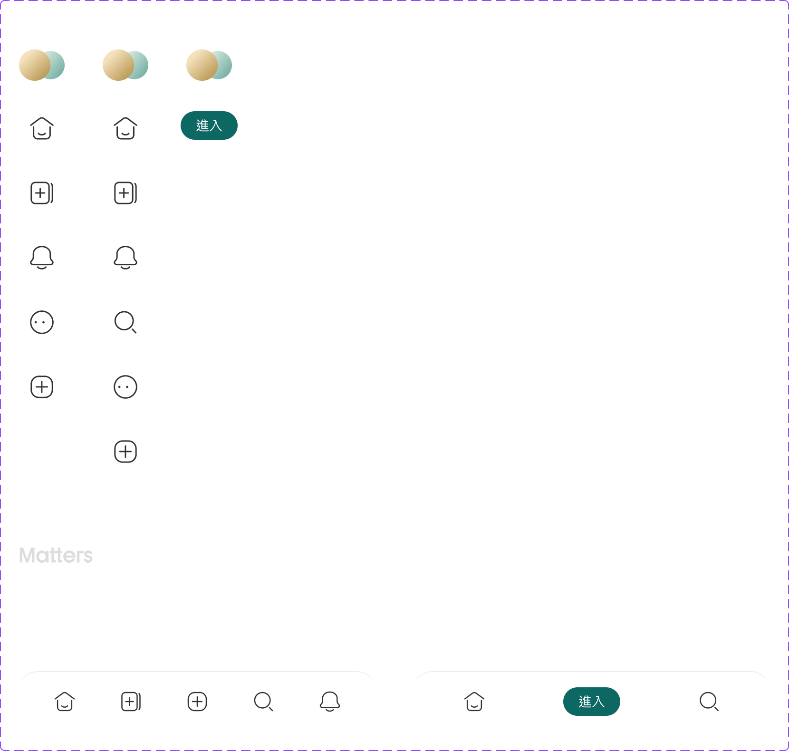

# Component: Navigation

## Overview

_（Figma 描述為空，請日後補完）_

## Source

- **Figma file**: Design System 1.5 (`JDKpHezhllOvJF42xbKcNN`)
- **Page**: Navigation
- **Type**: COMPONENT_SET
- **Node id**: `3276:7338`
- **Key**: `f63d503fc869296b253d46ad27cefdc484f4e9cb`
- **Open in Figma**: https://www.figma.com/design/JDKpHezhllOvJF42xbKcNN/Design-System-1.5?node-id=3276-7338

## Variants

| Property | Default | Options |
| --- | --- | --- |
| Device | `Desktop` | `Desktop`, `Mobile`, `Tablet` |
| View | `User` | `User`, `Visitor` |
| Type | `Navi` | `Navi`, `Header` |

### Variant nodes

- `Device=Mobile, View=User, Type=Navi` — node `3276:7339`
- `Device=Mobile, View=User, Type=Header` — node `4443:581`
- `Device=Mobile, View=Visitor, Type=Navi` — node `3276:7345`
- `Device=Desktop, View=User, Type=Navi` — node `3276:7349`
- `Device=Tablet, View=User, Type=Navi` — node `3276:7358`
- `Device=Desktop, View=Visitor, Type=Navi` — node `3276:7368`

## Design Tokens Used

### Linked Figma styles

| Figma style | Token (tokens.json) | Used for |
| --- | --- | --- |
| Grey Scale/White (`FILL`) | _待對照_ | _待補_ |
| Grey Scale/Grey Hover (`FILL`) | _待對照_ | _待補_ |
| Grey Scale/Black (`FILL`) | _待對照_ | _待補_ |
| Grey Scale/Grey Light (`FILL`) | _待對照_ | _待補_ |
| Logo/Matters Green (`FILL`) | _待對照_ | _待補_ |
| System/Body 2/Regular (`TEXT`) | _待對照_ | _待補_ |
| <unknown 2233:20512> (``) | _待對照_ | _待補_ |
| <unknown 2233:20513> (``) | _待對照_ | _待補_ |

### Fonts seen in tree

- PingFang TC / 400 / 14px

## States and Interactions

_實作時補入：hover / active / focus / disabled / loading / error_

## Responsive Behavior

_breakpoints 與 layout 變化（mobile / tablet / desktop）_

## Edge Cases

_長字串、空資料、權限不足等_

## Accessibility Notes

_對比度、鍵盤序、ARIA、screen reader_

## Dual-track Judgment

- 結構軌（atomic component）

## Preview

