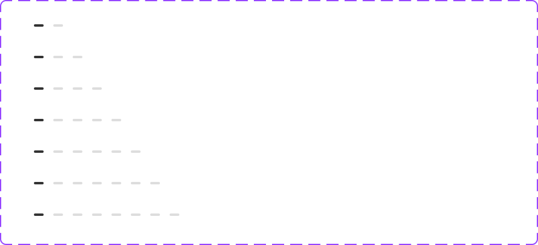

# Component: Indicator

## Overview

_（Figma 描述為空，請日後補完）_

## Source

- **Figma file**: Design System 1.5 (`JDKpHezhllOvJF42xbKcNN`)
- **Page**: Others
- **Type**: COMPONENT_SET
- **Node id**: `2901:1626`
- **Key**: `be980ae3cfd49f87b6fc80341bff44cd4ed5e4f0`
- **Open in Figma**: https://www.figma.com/design/JDKpHezhllOvJF42xbKcNN/Design-System-1.5?node-id=2901-1626

## Variants

| Property     | Default | Options                           |
| ------------ | ------- | --------------------------------- |
| No. of pages | `2`     | `6`, `2`, `3`, `4`, `5`, `7`, `8` |
| Dark mode    | `Off`   | `Off`, `On`                       |

### Variant nodes

- `No. of pages=2, Dark mode=Off` — node `2901:1627`
- `No. of pages=2, Dark mode=On` — node `4718:266`
- `No. of pages=3, Dark mode=Off` — node `2901:1633`
- `No. of pages=3, Dark mode=On` — node `4718:269`
- `No. of pages=4, Dark mode=Off` — node `2901:1641`
- `No. of pages=4, Dark mode=On` — node `4718:273`
- `No. of pages=5, Dark mode=Off` — node `2901:1651`
- `No. of pages=5, Dark mode=On` — node `4718:278`
- `No. of pages=6, Dark mode=Off` — node `2901:1663`
- `No. of pages=6, Dark mode=On` — node `4718:284`
- `No. of pages=7, Dark mode=Off` — node `2901:1677`
- `No. of pages=7, Dark mode=On` — node `4718:291`
- `No. of pages=8, Dark mode=Off` — node `2901:1693`
- `No. of pages=8, Dark mode=On` — node `4718:299`

## Design Tokens Used

### Linked Figma styles

| Figma style                    | Token (tokens.json) | Used for |
| ------------------------------ | ------------------- | -------- |
| Grey Scale/Black (`FILL`)      | _待對照_            | _待補_   |
| Grey Scale/Grey Light (`FILL`) | _待對照_            | _待補_   |
| Grey Scale/White (`FILL`)      | _待對照_            | _待補_   |
| Grey Scale/White 60% (`FILL`)  | _待對照_            | _待補_   |

## States and Interactions

_實作時補入：hover / active / focus / disabled / loading / error_

## Responsive Behavior

_breakpoints 與 layout 變化（mobile / tablet / desktop）_

## Edge Cases

_長字串、空資料、權限不足等_

## Accessibility Notes

_對比度、鍵盤序、ARIA、screen reader_

## Dual-track Judgment

- 結構軌（atomic component）

## Preview

