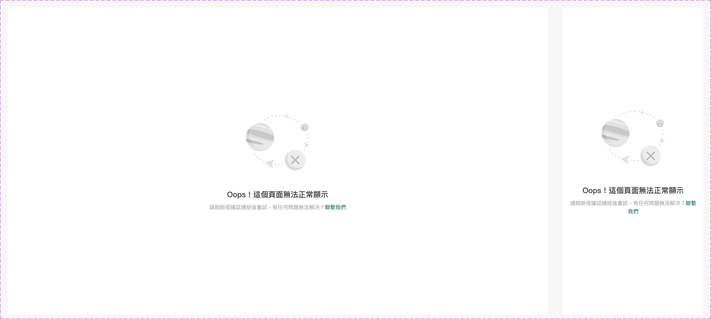

# Component: Error

## Overview

_（Figma 描述為空，請日後補完）_

## Source

- **Figma file**: Design System 1.5 (`JDKpHezhllOvJF42xbKcNN`)
- **Page**: Screen
- **Type**: COMPONENT_SET
- **Node id**: `3267:1736`
- **Key**: `a44f048dd8b31f6a86f4ef0a1c55cc5d30b165f5`
- **Open in Figma**: https://www.figma.com/design/JDKpHezhllOvJF42xbKcNN/Design-System-1.5?node-id=3267-1736

## Variants

| Property | Default | Options |
| --- | --- | --- |
| Type | `474px+` | `474px+`, `0px-474px` |

### Variant nodes

- `Type=474px+` — node `2779:164`
- `Type=0px-474px` — node `3267:1817`

## Design Tokens Used

### Linked Figma styles

| Figma style | Token (tokens.json) | Used for |
| --- | --- | --- |
| Grey Scale/Grey Lighter (`FILL`) | _待對照_ | _待補_ |
| Grey Scale/White (`FILL`) | _待對照_ | _待補_ |
| Grey Scale/Black (`FILL`) | _待對照_ | _待補_ |
| System/H2/Medium (`TEXT`) | _待對照_ | _待補_ |
| Grey Scale/Grey Dark (`FILL`) | _待對照_ | _待補_ |
| System/Body 2/Regular (`TEXT`) | _待對照_ | _待補_ |

### Fonts seen in tree

- PingFang TC / 500 / 20px
- PingFang TC / 400 / 14px

## States and Interactions

_實作時補入：hover / active / focus / disabled / loading / error_

## Responsive Behavior

_breakpoints 與 layout 變化（mobile / tablet / desktop）_

## Edge Cases

_長字串、空資料、權限不足等_

## Accessibility Notes

_對比度、鍵盤序、ARIA、screen reader_

## Dual-track Judgment

- 結構軌（含模板特徵，可能跨入模板軌；實作時再判定）

## Preview

