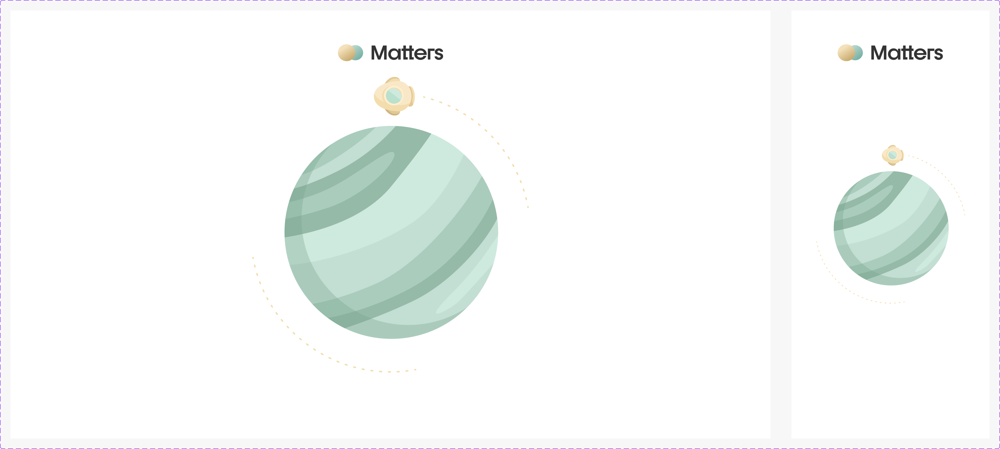

# Component: Splash2

## Overview

_（Figma 描述為空，請日後補完）_

## Source

- **Figma file**: Design System 1.5 (`JDKpHezhllOvJF42xbKcNN`)
- **Page**: Screen
- **Type**: COMPONENT_SET
- **Node id**: `2779:109`
- **Key**: `39eaee438e2b63d3f68d909dea9e8eb161e7c351`
- **Open in Figma**: https://www.figma.com/design/JDKpHezhllOvJF42xbKcNN/Design-System-1.5?node-id=2779-109

## Variants

| Property | Default        | Options                         |
| -------- | -------------- | ------------------------------- |
| Type     | `Large - 1280` | `Large - 1280`, `X Small - 375` |

### Variant nodes

- `Type=Large - 1280` — node `2779:110`
- `Type=X Small - 375` — node `2779:116`

## Design Tokens Used

### Linked Figma styles

| Figma style                      | Token (tokens.json) | Used for |
| -------------------------------- | ------------------- | -------- |
| Grey Scale/Grey Lighter (`FILL`) | _待對照_            | _待補_   |
| <unknown 2047:18843> (``)        | _待對照_            | _待補_   |
| <unknown 2779:97> (``)           | _待對照_            | _待補_   |
| <unknown 2047:18842> (``)        | _待對照_            | _待補_   |
| <unknown 2779:108> (``)          | _待對照_            | _待補_   |

## States and Interactions

_實作時補入：hover / active / focus / disabled / loading / error_

## Responsive Behavior

_breakpoints 與 layout 變化（mobile / tablet / desktop）_

## Edge Cases

_長字串、空資料、權限不足等_

## Accessibility Notes

_對比度、鍵盤序、ARIA、screen reader_

## Dual-track Judgment

- 結構軌（含模板特徵，可能跨入模板軌；實作時再判定）

## Preview

